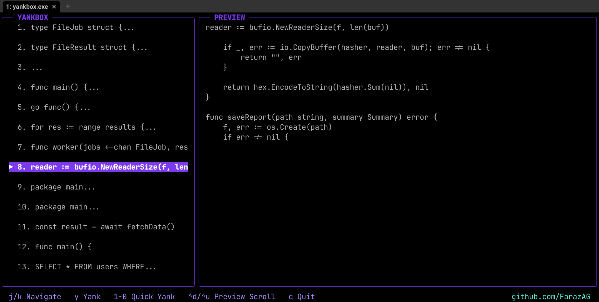

# YankBox

A clipboard history TUI for Windows, written in Go. Run it in your terminal!



## Installation

```powershell
go install github.com/FarazAG/yankbox/cmd/yankbox@latest
```

Or build from source:

```powershell
git clone https://github.com/FarazAG/yankbox.git
cd yankbox
go build -o yankbox.exe ./cmd/yankbox
```

## Usage

```powershell
yankbox
```

YankBox uses Windows Clipboard History, so make sure it is enabled in:

**Settings → System → Clipboard → Clipboard history**

## Controls

```text
j / k       Navigate
↑ / ↓       Navigate
y           Yank
1 - 9       Quick yank
0           Quick yank #10
Ctrl+D      Scroll preview down
Ctrl+U      Scroll preview up
q           Quit
```

## Features

- Browse Windows Clipboard History
- Live history updates
- Full text preview
- Quick yank with number keys
- Keyboard navigation

## License

MIT
